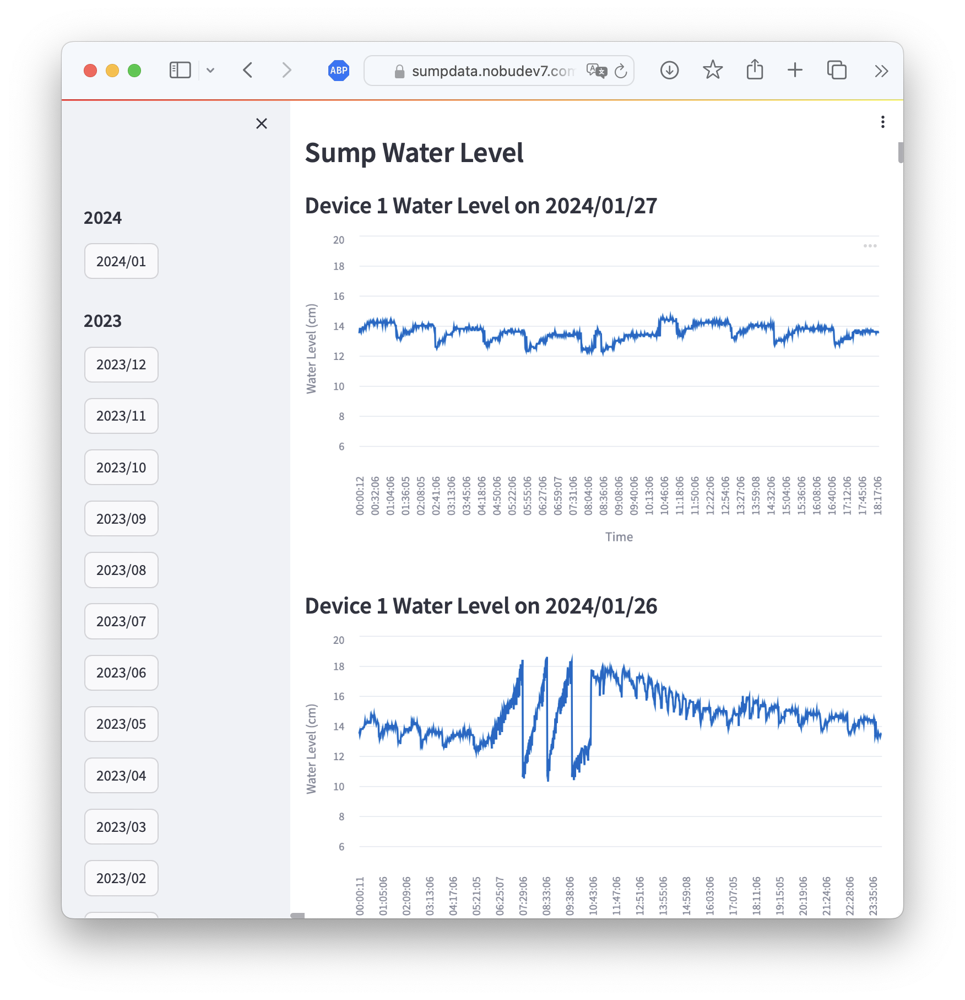

# sumpchart
[](https://github.com/ntamagawa/sumpdata/blob/main/LICENSE)

Visualization of sump water level data managed by [Sump Water Level Application](https://github.com/ntamagawa/sumpdata) server.



## Environments
This web application is based on streamlit.
- Python 3
- streamlit (tested 1.28)
- pandas (tested 2.1)

## Run
``` shell
(venv) $ streamlit run sumpchartapp.py

  You can now view your Streamlit app in your browser.

  Local URL: http://localhost:8501
  Network URL: http://192.168.1.169:8501

```

